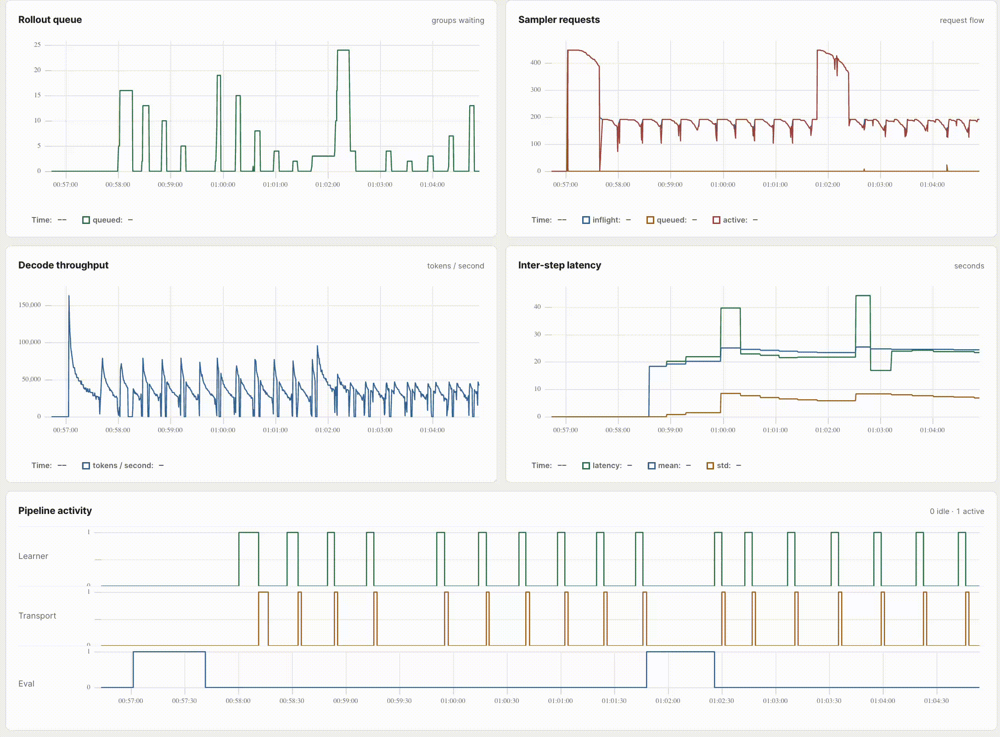

# Parallax

<picture>
  <source media="(prefers-color-scheme: dark)" srcset="assets/parallax-readme-dark.png">
  
</picture>

---

Parallax is a simple, pedagogical, single-node asynchronous RL training setup. It is designed to be minmal and hackable to test various RL algorithms and systems changes across the trainer, weight-transport and sampler.

The learner is written in pure JAX; while, the sampler is a light-weight inference engine built on [`nano-vllm`](https://github.com/GeeeekExplorer/nano-vllm).

## Key features

- **Mixed-policy rollouts, à la PipelineRL:** update sampler weights between
  decode steps of active rollouts to keep sampling and learning moving
  concurrently.
- **NCCL M2N weight streaming:** stream and reshard weights directly from the
  JAX learner GPUs into live PyTorch sampler parameters.
- **Gradient accumulation + chunked cross-entropy:** accumulate normalized
  gradients over microbatches in a compiled JAX scan while computing
  target-token log probabilities without materializing full vocabulary logits.
- **JAX learner + PyTorch-based sampler:** keep training and inference in
  separate, purpose-built runtimes.

## Quick start

```bash
docker run --rm --gpus all \
  --ipc=host \
  --ulimit memlock=-1:-1 \
  --network host \
  -v parallax-hf:/root/.cache/huggingface \
  -v "$PWD/runs:/app/runs" \
  -e HF_TOKEN \
  -e WANDB_API_KEY \
  saurabhdash2512/parallax:v0.1.0 \
  --config configs/qwen3-0.6b-cispo.toml
```

## Development

The development image contains the pinned NVIDIA JAX image and `uv`. From a
source checkout, mount the repository into the container:

```bash
docker run --rm -it --gpus all \
  --ipc=host \
  --ulimit memlock=-1:-1 \
  --network host \
  -v "$PWD:/app" \
  -v parallax-hf:/root/.cache/huggingface \
  -e HF_TOKEN \
  -e WANDB_API_KEY \
  -w /app \
  saurabhdash2512/parallax-base:v0.1.0 \
  bash
```

```bash
bash setup.sh
uv run python main.py --config configs/qwen3-0.6b-cispo.toml
```

Parallax requires Linux, Python 3.12, [`uv`](https://docs.astral.sh/uv/), and
NVIDIA GPUs with a CUDA 12.9-compatible driver.

Parallax deliberately uses separate environments for the coordinator, learner,
and sampler. Keeping JAX and PyTorch/CUDA dependencies isolated makes their
version and CUDA requirements explicit and simple to iterate on.

`setup.sh` creates or updates all three environments from their lockfiles.

The sampler lockfile selects the CUDA 12.8 PyTorch index and installs the
matching FlashAttention wheel. Both GPU environments use NCCL 2.30.7 and
NCCL M2N for direct learner-to-sampler weight resharding.

The default configuration needs eight GPUs: two for the JAX learner and six
one-GPU sampler replicas. Adjust `fsdp_size`, `num_replicas`, and the
parallelism settings in a TOML config to fit another topology. The launcher
verifies the requested GPU count with `nvidia-smi` before it starts.

The entry point starts the sampler on its assigned GPUs, starts the learner on
the remaining GPUs, initializes both from the configured Hugging Face model,
and runs until the multiplication dataset is exhausted.

The default task teaches `Qwen/Qwen3-0.6B` N-digit multiplication.

`configs/qwen3-0.6b-cispo.toml` also enables Weights & Biases in online mode. Authenticate
with W&B before running, or set `mode = "disabled"` in the `[wandb]` section of
a copied config when metrics should stay local.

## Speedrun

Presenting *parallax-speedrun*, inspired by Keller Jordan's
*nanoGPT-speedrun*. The separate `speedrun` branch contains changes for
comparing end-to-end training time while keeping the original code minimal.

**Model: Qwen3-0.6B**

**Task: 5×5 multiplication · target pass@1 ≥ 0.80**

| Contributors | Observed pass@1 | Step | Time |
| --- | ---: | ---: | ---: |
| Baseline | 0.8242 | 102 | 1,810.356s |

Comparisons should use the same model, task, target, and checked-in speedrun
configuration, and should report the hardware used.

## Run a speedrun

```bash
uv run python main.py --config configs/qwen3-0.6b-cispo.toml --speedrun
```

The `[speedrun]` config sets the number of training steps, number of final
checkpoints to evaluate, and target pass@1. Training skips evaluation and saves
one timed checkpoint per learner update. It then shuts down the training
processes and launches a fresh sampler that loads the first evaluation
checkpoint normally and swaps the remaining checkpoints in place. Results are
written to `runs/speedrun-*/speedrun-result.json`.

### Speedrun baselines

| Model | Task | Target pass@1 | Observed pass@1 | Step | Time including setup |
| --- | --- | ---: | ---: | ---: | ---: |
| Qwen3-0.6B | 5×5 multiplication | ≥0.8 | 0.8242 | 102 | 1810.356s |

## Live dashboard

Training serves a live performance dashboard at
`http://127.0.0.1:8001`. It shows request flow, sampler throughput, learner
timings.

For a remote host, forward the dashboard over SSH:

```bash
ssh -N -L 8001:127.0.0.1:8001 user@host
```



## Repository layout

```text
.
├── main.py                 command-line entry point
├── configs/                model, topology, rollout, transport, and W&B config
├── parallax/
│   ├── envs/               rollout tasks and deterministic reward functions
│   ├── learner/            JAX model, GRPO objective, optimizer, and weights
│   ├── sampler/            sampler client plus the standalone PyTorch/CUDA server
│   ├── dashboard.py        live pipeline metrics and dashboard server
│   ├── launcher.py         process launcher and GPU partitioning
│   ├── orchestrator.py     bounded concurrent rollout-to-update pipeline
│   ├── transport.py        versioned learner-to-sampler weight publication
│   ├── train.py            learner-process entry point
│   └── metrics.py          metrics abstraction and W&B implementation
```

## Citation

If you use Parallax in your work, you can cite it using:

```bibtex
@software{dash2026parallax,
  author  = {Saurabh Dash},
  title   = {Parallax: A Minimal Asynchronous Reinforcement Learning Training System},
  year    = {2026},
  version = {0.1.0}
}
```

## attribution

The inference engine in `parallax/sampler/nanovllm/` is derived from
[nano-vllm](https://github.com/GeeeekExplorer/nano-vllm) by Xingkai Yu and has
been modified for Parallax.
